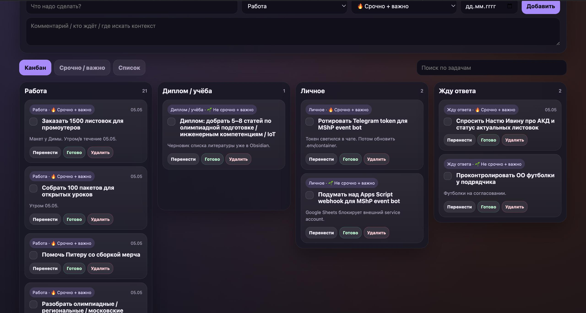
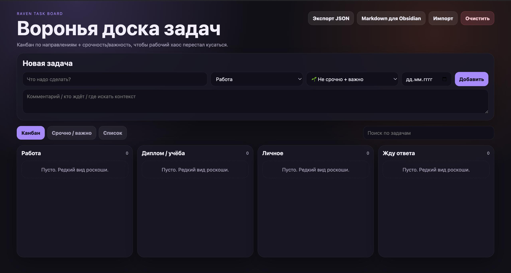
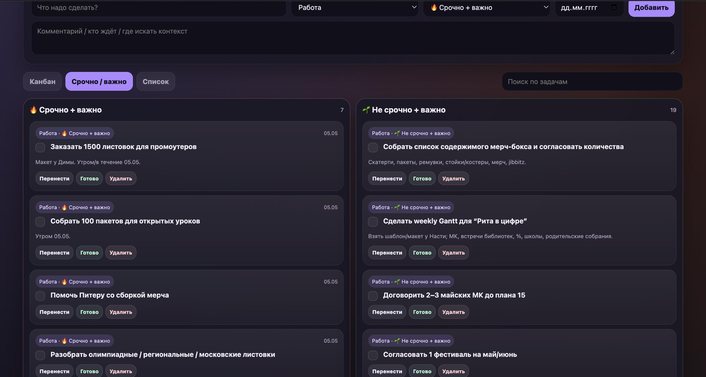

# Raven Task Board / Воронья доска задач

Мини-сайт для личной операционки: канбан по направлениям, матрица Эйзенхауэра, фокус дня, архив выполненных задач и синхронизация с Obsidian.

Проект родился как вечерний MVP для реального рабочего хаоса: задач много, контекста много, хочется видеть не только «что есть», но и «что горит прямо сейчас».

## Возможности

- Добавление задач с направлением, квадрантом, датой и комментарием.
- Редактирование задач без удаления и пересоздания.
- Канбан по направлениям: работа, диплом/учёба, личное, ожидание ответа.
- Матрица Эйзенхауэра: срочно/важно.
- Блок **«Сегодня»** с количеством задач на сегодня, просроченных и ближайших на неделю.
- Фильтры: все / сегодня / просрочено / неделя.
- Drag & drop между колонками и квадрантами.
- Изменение направления, квадранта, даты и текста через кнопку **Править**.
- Закрытие задач чекбоксом, мини-феерверком и вороном.
- Вкладка закрытых задач с возможностью вернуть задачу в работу.
- Локальное сохранение в браузере через `localStorage`.
- Экспорт/импорт JSON.
- Экспорт Markdown для Obsidian.
- Опциональный backend, который пишет состояние доски прямо в Markdown-файл Obsidian.

## Скриншоты

### Канбан



### Матрица срочности и важности



### Пустое состояние



## Стек

- Frontend: vanilla HTML, CSS, JavaScript.
- Backend: Node.js built-in `http`, без Express и тяжёлых зависимостей.
- Storage:
  - browser-only fallback: `localStorage`;
  - local backend mode: Markdown-файл в Obsidian + служебный JSON-блок внутри заметки.
- Sync: Syncthing может разносить Obsidian vault между устройствами.

## Запуск

### Вариант 1: просто открыть HTML

Можно открыть `index.html` в браузере. В этом режиме данные живут в `localStorage`, backend не нужен.

### Вариант 2: локальный сервер + Obsidian sync

Backend по умолчанию закрыт HTTP Basic Auth. Перед запуском задайте логин и пароль через переменные окружения:

```bash
RAVEN_AUTH_USER="your-login" \
RAVEN_AUTH_PASSWORD="your-long-random-password" \
node server.js
```

Открыть:

```text
http://localhost:8099
```

Для локальной разработки без авторизации можно явно отключить защиту:

```bash
RAVEN_REQUIRE_AUTH=false node server.js
```

Не отключайте `RAVEN_REQUIRE_AUTH` на публичном сервере. Если логин/пароль не заданы, сервер будет отвечать `401 Authentication required`, чтобы случайно не выложить личную доску наружу.

По умолчанию backend пишет состояние сюда:

```text
/home/sunrise/Obsidian/данные о владельце/работа/Воронья доска задач.md
```

Путь можно переопределить переменной окружения:

```bash
RAVEN_OBSIDIAN_FILE="/path/to/board.md" node server.js
```

## Формат Obsidian-файла

Файл выглядит как обычная Markdown-заметка: задачи разложены по квадрантам, ниже есть архив закрытых задач.

В конце хранится служебный JSON-блок:

````markdown
```raven-task-board-json
{
  "tasks": []
}
```
````

Его лучше не ломать руками: приложение читает состояние именно оттуда.

## Важно про приватность

Репозиторий не содержит личный Obsidian-файл с задачами. Реальные задачи создаются локально при запуске backend-режима и не должны попадать в Git.

Для публичного деплоя используйте HTTPS перед сервером: Basic Auth безопасен только поверх TLS. Текущий HTTP Basic Auth — временный защитный слой до нормального OAuth-входа, например через GitHub.

## Идеи для развития

- GitHub Pages/demo mode без backend.
- Теги и кастомные направления.
- Повторяющиеся задачи.
- Импорт/экспорт из Markdown task list.
- PWA-режим для телефона.
