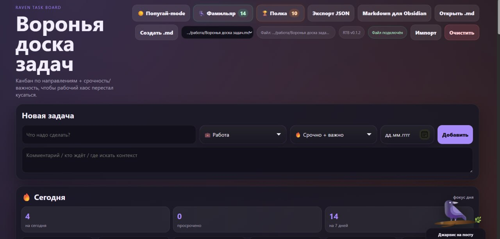
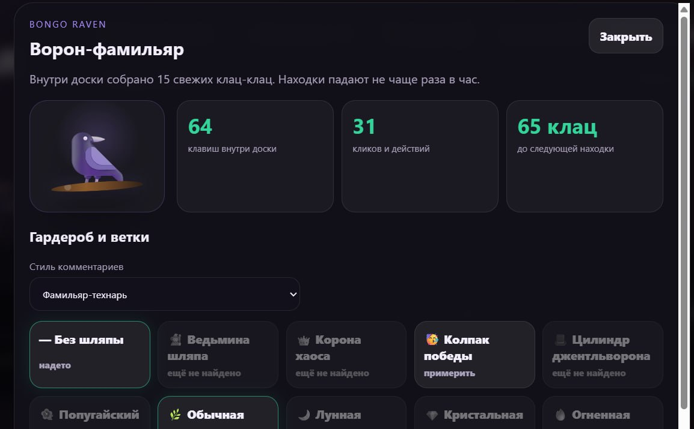
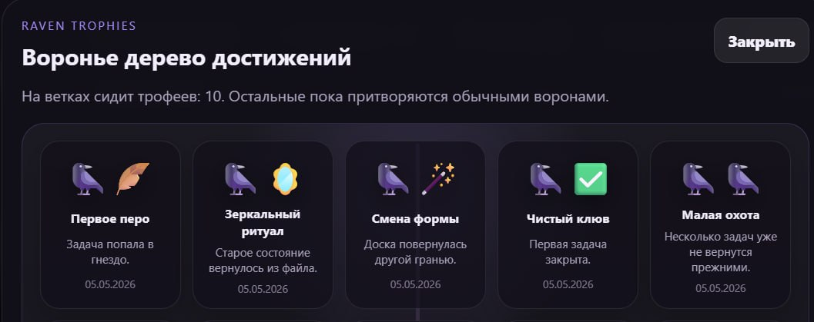
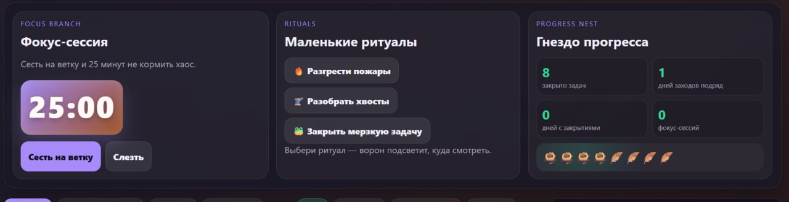
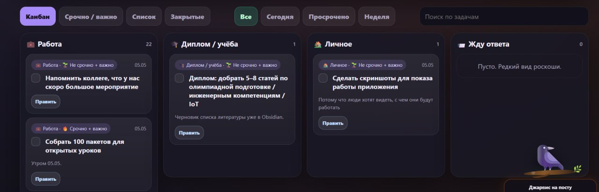
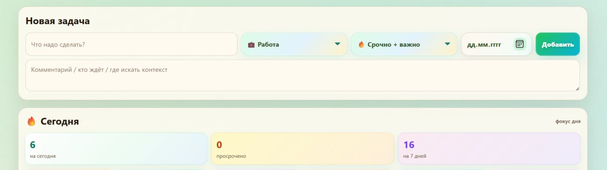
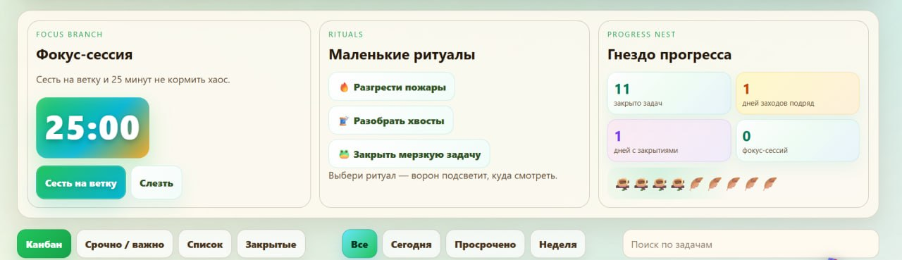
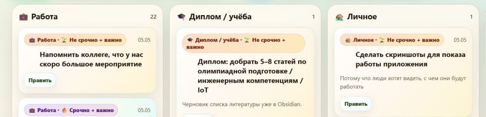
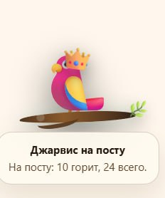

# Raven Task Board / Воронья доска задач

   

**Raven Task Board** — маленькая local-first доска задач для людей, которые живут в Markdown/Obsidian и не хотят превращать личную операционку в Jira на минималках.

Задачи можно вести прямо в браузере, в desktop-приложении или через локальный backend, который сохраняет состояние в Markdown-файл Obsidian. Данные остаются у пользователя: репозиторий не содержит личных задач и не требует внешнего облака.

> Статус: ранний open-source прототип. Код открыт, приложение уже полезно, но desktop-сборки пока **без code signing / notarization** — операционная система может предупреждать при первом запуске.

## Что умеет

- Канбан по направлениям: работа, диплом/учёба, личное, ожидание ответа.
- Матрица срочности/важности.
- Блок **«Сегодня»**: задачи на сегодня, просроченные и ближайшая неделя.
- Фильтры: все / сегодня / просрочено / неделя.
- Редактирование задач через **Править** без удаления и пересоздания.
- Закрытие задач чекбоксом и архив выполненного.
- Фокус-сессия на 25 минут и маленькие ритуалы для разгребания хаоса.
- Фамильяр Джарвис: реакции, реплики, косметика, достижения и режим попугая.
- Локальное хранение в `localStorage` или Markdown-файл Obsidian через backend/desktop.
- Экспорт/импорт JSON и экспорт Markdown.

## Скриншоты

### Основная доска, тёмная тема



### Фамильяр и косметика



### Достижения



### Фокус и ритуалы



### Канбан



### Светлая тема и попугай-mode









## Быстрый запуск

```bash
npm install
npm start
```

Открыть:

```text
http://localhost:8099
```

Просто посмотреть без backend тоже можно: откройте `index.html` в браузере. В таком режиме данные живут в `localStorage`.

## Desktop-приложение

Локальная разработка:

```bash
npm install
npm run desktop:dev
```

Сборка desktop-пакета:

```bash
npm run desktop:build
```

Готовые Windows/macOS-сборки лежат в [Releases](https://github.com/NeMarusia/raven-task-board/releases). Пока они не подписаны сертификатом, поэтому macOS/Windows могут показывать предупреждения. Это не скрытая магия, просто у проекта ещё нет code signing.

Подробности: [INSTALL.md](INSTALL.md). История изменений: [CHANGELOG.md](CHANGELOG.md).

## Obsidian / Markdown storage

В backend-режиме состояние пишется в Markdown-файл. Путь можно переопределить:

```bash
RAVEN_OBSIDIAN_FILE="/path/to/board.md" node server.js
```

В конце файла хранится служебный блок:

````markdown
```raven-task-board-json
{
  "tasks": []
}
```
````

Обычный текст заметки можно читать в Obsidian, но JSON-блок лучше не ломать руками: приложение читает состояние оттуда.

## Приватность и безопасность

- Личные задачи не должны попадать в Git.
- Browser-only режим хранит данные локально в браузере.
- Backend не имеет встроенной авторизации: для публичного деплоя запускайте его только за reverse proxy и закрывайте доступ на уровне Traefik/Nginx/Caddy.
- Для личной публичной инсталляции используйте HTTPS и авторизацию. Basic Auth допустим только поверх TLS.

## Roadmap

Коротко: GitHub Pages demo, больше настроек направлений, повторяющиеся задачи, импорт Markdown task list, PWA и нормальная подпись desktop-сборок.

Полный список: [ROADMAP.md](ROADMAP.md).

## Лицензия

ISC — см. [LICENSE](LICENSE).
